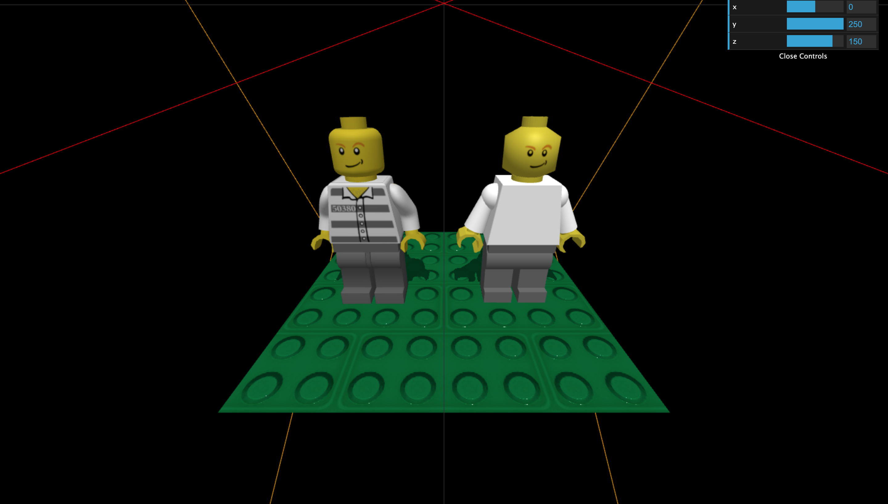
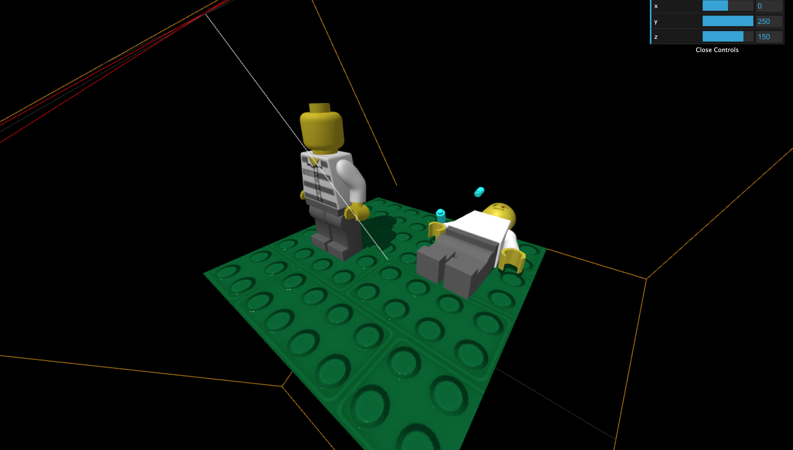

# CGAni - Lego

We build a Lego figure out of native geometry, inspired by a Lego-fbx-Model.

# Usage

- Use Visual Studio Code
  - Use Live Server ("Go Live") on inde.html

**Features**

* Press 'p' for Music play/stop
* Press 'space' for shooting
* Click on Lego Head

# Anforderungen "Zwillings-Demonstrator"

- [X] Struktur/Aufbau
- [X] Animation(en)
- [X] Material(ien)
- [X] Textur(en)
- [X] Physik
- [X] Sound(s)
- [X] Schatten

## Getting Started

You only need to download/clone this Project and open it in a browser. The libraries needed for this Project are already added to the repository.

## Built With

* [THREE.JS](https://threejs.org/)
* [Lego Model](https://www.turbosquid.com/3d-models/lego-minifigure-lwo/619834) - Lego-fbx-Model

## Authors

* **Klaus** - [Fjiz](https://github.com/Fjiz)
* **Carsten** - [MSCarstenC](https://github.com/MScarstenC)
